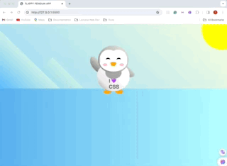

# PENGUIN APP

The application was built as a practice project for a responsive web design course with FreecodeCamp. It features a cute Flappy penguin that waves and grows on you when you give him a cuddle. Built with HTML and CSS.

## Features

- The penguin is standing in the middle of an icy landscape on a bright sunny day.
- The penguin has "I 💜 CSS" imprinted on his belly (as he should!).
- The penguin waves with his left arm.
- The penguin increases size when clicked on.

## Technologies

- HTML
- CSS

## Start the App

In the project directory, you can run it with the Live Server by right-clicking on the index.html.

It will run the app in development mode.\
Open [http://127.0.0.1:5500](http://127.0.0.1:5500/index.html) to view it in your browser.

When making changes, make sure you reload to see it on the page.

### Author

[Tanimara Elias Santos](https://github.com/tanimaraeliassantos)

### Version

1.0.0
